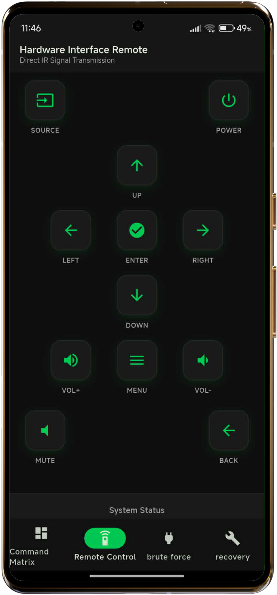
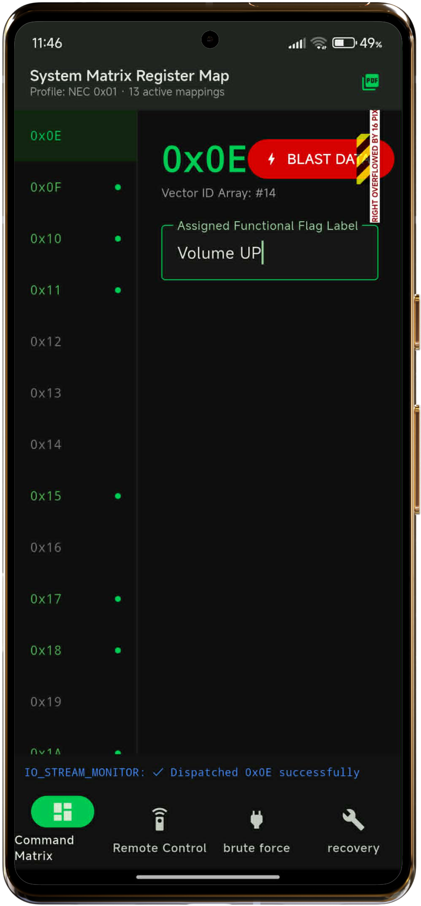
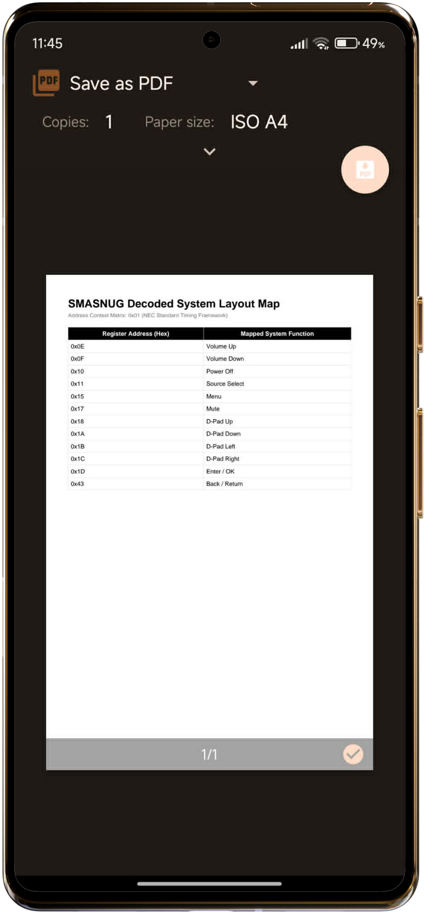
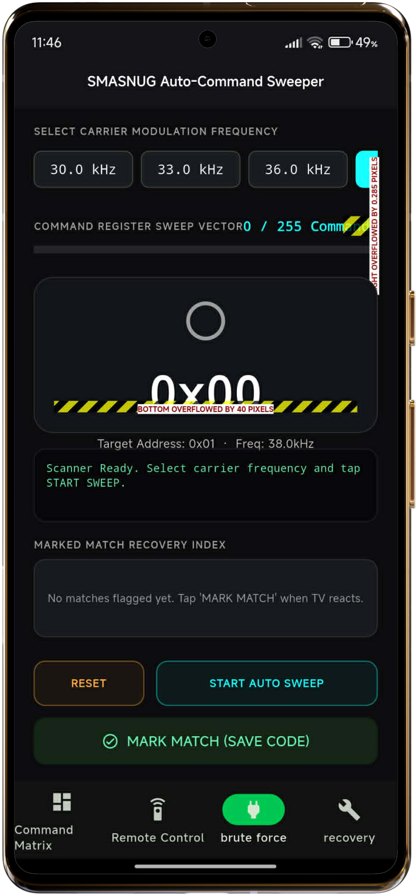
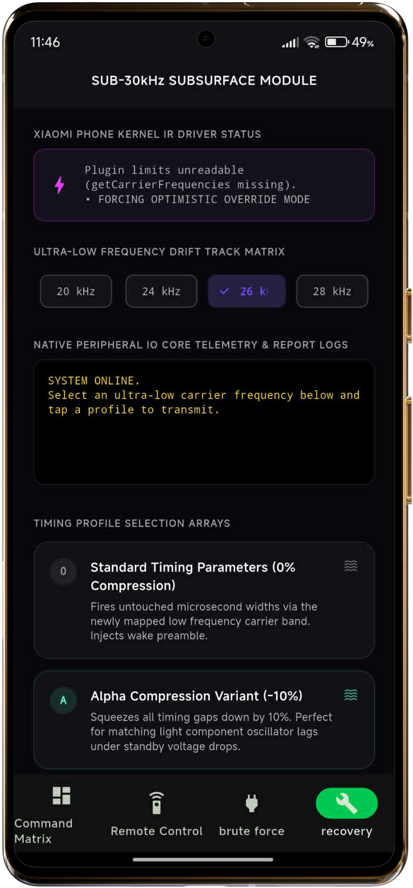

# 📱 Remote Control

[](https://flutter.dev)
[](https://www.android.com)
[](LICENSE)

**Remote Control** is a Flutter application engineered to map, manage, and transmit infrared (IR) commands to SMASNUG( Samsung knockoff ) android TV . It combines a touch-friendly remote interface, a centralized command matrix mapper, and a low-latency background service to bridge mobile software with legacy hardware peripherals.

> 🛠️ **The Backstory:** This project stems from a real-world problem. It was a backup plan for when the TV's original remote broke, because I can't buy a replacement, I built this app to control the TV directly from my phone — but getting there meant reverse-engineering the television's physical IR receiver from scratch, since no documentation existed for it. What started as a practical fix doubled as a hands-on showcase of real reverse-engineering: identifying the IR protocol, brute-forcing the device address, and mapping the full command set from nothing but trial and error.
---
> **Note on development process.** This code was generated by AI. My role was primarily guiding the direction, researching/finding relevant information, and testing — not writing the implementation directly. This was a rushed job, so expect rough edges and please review accordingly.
---

## 📑 Table of Contents

- [Try It Yourself](#-try-it-yourself)
- [Engineering Log](#-engineering-log-reverse-engineering-the-ir-protocol)
- [Features & Capabilities](#️-features--capabilities)
- [Current Scope & Limitations](#️-current-scope--limitations)
- [Tech Stack & Dependencies](#-tech-stack--underlying-dependencies)

---

## 📥 Try It Yourself

Download the latest production APK directly to your device to explore the interface and architecture.

📦 **[Download Latest APK Release](https://github.com/yourname/remote-control/releases/latest)**

> 📡 **Hardware requirement:** Your phone must have a built-in **IR blaster** (infrared transmitter) for this app to work. Most modern phones do not include one — it's mainly found on certain Xiaomi, Huawei, and older Samsung/HTC models. If your device lacks an IR blaster, the app will install but won't be able to transmit any commands.

> ⚠️ **Scope note:** This build is currently configured to work *only* with the SMASNUG ( Samsung-knockoff ) Andoird TV, it was reverse-engineered against (see [Limitations](#️-current-scope--limitations)). It's shared primarily as a **pesonnel backup plan**, not as a universal remote.

### Installation Steps

1. Download `app-release.apk` from the [releases page](https://github.com/yourname/remote-control/releases/latest).
2. If prompted, allow installation from unknown sources in your Android system settings.
3. Open the downloaded file to complete installation.
4. Launch the app and grant **IR blaster permissions** when requested.

<p align="left">
  
  
  
  
  
</p>

---

## 🔍 Engineering Log: Reverse-Engineering the IR Protocol

With no technical documentation or command references available for the target TV, the protocol layer had to be manually extracted through empirical hardware analysis:

```
Regulatory Docs (licences used) ──▶ Identify NEC Protocol ──▶ Address Brute-Force (0x00–0xFF) ──▶ Success (0x01) ──▶ Iterative Key Mapping ──▶ Flutter Integration
```

1. **Protocol identification.** Analyzed the television's regulatory filings and FCC licensing documentation to isolate the exact hardware component responsible for IR reception. This pointed directly to the **NEC IR protocol** standard.
2. **System address recovery.** NEC protocol packets require a valid 8-bit system address before the receiver will parse subsequent command bytes. This address space (`0x00`–`0xFF`) was systematically brute-forced against the physical receiver until a hardware state change was achieved. The target responded successfully to address `0x01`.
3. **Command mapping.** With a valid address isolated, I built an internal diagnostic UI tool to capture and label individual hex command strings. Each button was sequentially tested against the TV, enabling a rapid **Capture → Label → Verify** loop to map functions like power, volume, and channel keys.
4. **Production build-out.** Once the full functional matrix was mapped, the raw hexadecimal commands were compiled into an immutable hardware configuration registry and bound to a reactive Flutter frontend using the native Android Consumer IR API.

---

## 🛠️ Features & Capabilities

- **🎛️ Ergonomic remote interface** — A clean, mobile-optimized control layout mimicking traditional hardware remotes (power, volume tracking, channel steps, and source toggles).
- **📋 Command matrix mapper** — A developer-focused interactive registry where raw hexadecimal command registers can be labeled, updated, and re-mapped dynamically.

---

## ⚠️ Current Scope & Limitations

- **Scoped utilities.** To keep this release safe for standard users, the raw frequency-sweeping and address brute-forcing diagnostic tools used during development have been **omitted from this build**.
- **Wake-on-IR status.** The "wake screen on" behavior **is disabled/non-functional** in this iteration for unknown reasons. It should work based on the implementation, but it does not..
- **Hardware interoperability.** This build is was targeted at a **SMASNUG TV** and does **not** guarantee support for mainstream, universal brand matching out of the box.

---

## 💻 Tech Stack & Underlying Dependencies

The application architecture prioritizes strict separation of concerns, decoupling presentation state from low-level native hardware method channels.

| Dependency | Purpose |
| :--- | :--- |
| **Flutter / Dart** | Cross-platform UI layout engine and system channel management. |
| **`provider`** | Reactive state management, dependency injection, and hardware state streams. |
| **`infrared_plugin`** | Low-level bridge communicating directly with Android's physical `ConsumerIrManager` API. |
| **`flutter_local_notifications`** | Manages foreground execution channels and captures notification action tray intents. |
| **`pdf` / `printing`** | Handles document layout generation and coordinates native Android print-spooler tasks. |
---